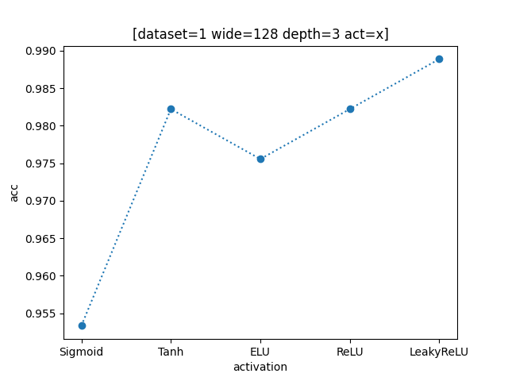

## **【报告】Homework3**

### **1.【概括】**

Python 基于 Pytorch 实现前馈神经网络 FNN 进行昆虫分类。

### **2.【网络模型】**

**【main.py】**

对于每组昆虫数据 `(x,y,label)`，将`(x,y)` 作为网络输入，`label=0/1/2` 转化为多分类概率作为网络输出。

即网络结构设置为 `[2,width,...,width,3]`，大小为 `width` 的隐藏层个数即为深度。

- 前向计算：对于每组输入信息，每个隐藏层使用线性函数+激活函数 `act` 进行拟合，输出层使用 `Logsoftmax` 函数归一化，得到三种类别的概率。

- 反向计算：使用对数损失函数 `NLLLoss` 计算每一层参数的偏导数。

- 更新参数：使用 `Adam` 优化器，学习率设置 `0.0025`。

```python
#————[模型搭建]————#
class FNN(nn.Module):
    def __init__(self,wide:list,act): #wide储存每层节点数
        ...

    def forward(self,x):
        ...

if __name__=='__main__':
	#————[模型搭建]————#
    model=FNN(wide=[2,*[_wide]*_depth,3],act=_act) #使用FNN模型
    criterion=nn.NLLLoss() #对数损失函数
    optimizer=torch.optim.Adam(model.parameters(),lr=0.0025) #Adam优化器
```

输出层概率最大者作为模型预测类别，与标准类别比较，计算准确率，并绘制四色散点图。

> 类别 `label=0/1/2` 分别使用 `red`、`green`、`blue`，预测失败的点使用 `black`。

```python
#————[性能评估]————#
def pred(model,criterion,x_,y_,name="test60",title="",draw=False):

    #对指定数据调用模型进行预测
    ...

    acc,tot=0,0 #acc:预测正确的个数 tot:总个数
    ...

    if draw==True:
        # 绘散点
        ...

    return acc/tot #计算准确率
```

由于训练出的模型性能有波动，进行三次重复实验取平均值。

```python
_times=3 #重复实验次数
acc_=[] #网络性能（acc:正确率）
for T in range(_times):
    #————[模型搭建]————#
    ...

    #————[模型训练]————#
    _epochs=300 #总训练次数
    ...

    #————[调参分析/数据测试]————#
    ...
    acc_.append(...)

#计算网络性能平均值
acc_average=...
```

<div STYLE="page-break-after: always;"></div>
### **3.【参数调整】**

**【main.py】**

数据集使用前随机打乱，在 `1-training` 上训练模型，使用 `1-testing` 评估性能、调整参数。

> 从训练集中随机抽取的60个数据不适合作用于调参测试（会造成过拟合），故不使用。
> 由于数据量过少，故不单独拆出验证集。

对比实验后选择参数如下：

```python
#————[参数]————#
_wide=128 #网络宽度(隐藏层每层节点数量)
_depth=3 #网络深度(隐藏层数量)
_act=nn.LeakyReLU() #激活函数类型(Sigmoid,Tanh,ReLU,ELU,Softplus)
```

 `1-testing` 表现如下：

> 准确率：`acc=[0.966667, 1.000000, 0.986667]`
> 平均值：`acc_average=0.984444`。

_test150_0.png)

_test150_1.png)

_test150_2.png)

<div STYLE="page-break-after: always;"></div>
**【plots.py】**

将测试集上调参对比所得数据绘制图表。纵坐标使用正确率 $acc$。

#### **(1).【激活函数 activation】**

固定其他参数，分别尝试 $\text{Sigmoid,Tanh,ELU,ReLU,LeakyReLU}$ 五种激活函数，每组参数取三次重复试验 $acc$ 平均值。

$\text{Sigmoid}$ 性能最劣。剩余四者大约为同一量级，其中 $\text{ELU}$ 略差。



<div STYLE="page-break-after: always;"></div>
#### **(2).【网络深度 depth】**

固定其他参数，分别取 $depth=1,2,3,4,5,6$ 进行测试，每组参数取三次重复试验 $acc$ 平均值。

深度较小时泛化能力差，无法模拟复杂情况。

深度较大时时间复杂度大幅上升，且存在梯度消失的问题，导致网络性能波动较大。


<div STYLE="page-break-after: always;"></div>
#### **(3).【网络宽度 width】**

固定其他参数，分别取 $width=4,8,16,32,64,128,256$ 进行测试，每组参数取三次重复试验 $acc$ 平均值。

宽度较小时，模型泛化能力差。增大到一定量级后饱和，不再有明显提升，甚至可能变劣。


<div STYLE="page-break-after: always;"></div>
### **4.【结果展示】**

应用相同参数在 `2-training` 上训练模型，使用 `2-testing` 检验。

数据集2中的噪声增加了过拟合风险，网络性能比之数据集1变劣。

 `2-testing` 表现如下：

> 准确率：`acc=[0.973333, 0.940000, 0.966667]`
> 平均值：`acc_average=0.960000`。

_test150_0.png)

_test150_1.png)

_test150_2.png)

<div STYLE="page-break-after: always;"></div>
### **5.【问题】**

- 网络性能波动大，时好时坏影响判断，重复实验次数设置太低（受限于设备运行效率）。
- 尝试添加 $\text{Dropout }$ 层以处理噪声，但效果不佳。故未采用。