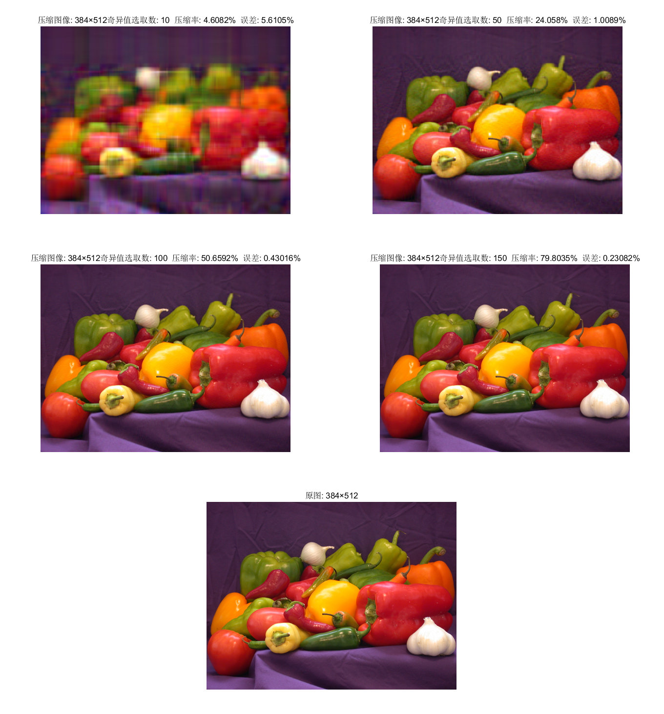
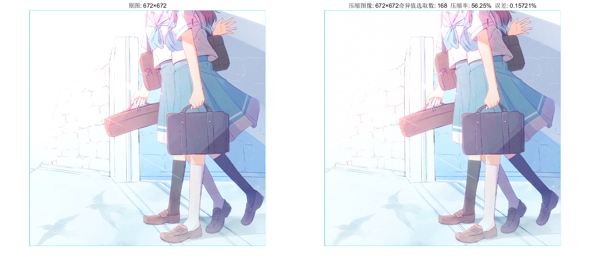
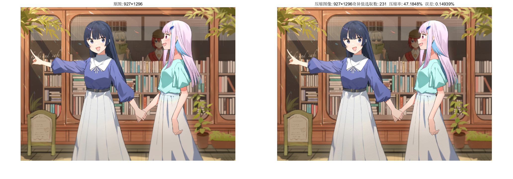

## **【报告】Homework2**

==85肖羿==

### **1.【概括】**

Matlab 实现基于矩阵 SVD 分解的图像压缩。

### **2.【算法介绍】**

分别对RGB三个图层的颜色矩阵进行 SVD 分解 $\boldsymbol A_{m\times n}=\boldsymbol U_{m\times m} \boldsymbol \Sigma_{m\times n} \boldsymbol V^T_{n\times n}$ 。

由于奇异值逐渐减小，选取前 $k$ 个较大的奇异值，利用 $\boldsymbol U$ 和 $V$ 的前 $k$ 列子矩阵重新构造新的颜色矩阵 $\boldsymbol B_{m\times n}=\boldsymbol U_{m\times k} \boldsymbol \Sigma_{k\times k} \boldsymbol V^T_{n\times k}$，则需储存 $mk+k^2+kn$ 大小的信息。

$rate=\frac{压缩后的数据量}{\text{原数据量}}=\frac{mk+k^2+kn}{mn}$ 表示压缩率。当满足 $k< \frac{1}{2}(\sqrt{m^2+n^2+6mn}-m-n)$ 时压缩率小于 $100\%$ 。

$error=\frac{||A-B||_{2}}{||B||_{2}}$ 表示误差（压缩后的图像损耗）。

> 实际计算时取三个图层的 $A-B$ 矩阵范数总和除以 $B$ 矩阵范数总和。

### **3.【结果分析】**

随着奇异值选取数 $k$ 的增加，误差 $error$ 逐渐减小，压缩率 $rate$ 逐渐增大。

对于 $384\times 512$ 的图像，当 $k=100$ 时，图像已十分清晰，与原图几乎无异，但能节省约一半的储存空间。

压缩率与奇异值选取数呈正比。

误差与压缩率、奇异值选取数均呈反比。

### **4.【应用】**

对于更大的图像，选取总数约 $\frac{1}{4}$ 以上的奇异值，均能获得几乎无画面损耗的压缩效果（压缩率约为 $50\%$ 上下）。

### **5.【问题】**

实际考虑压缩误差时依赖于视觉差异，不需要太高的精度，上述误差 $error$ 表示式对实际压缩程度的选取参考性不大，仅做同图像比较使用。